# Learning Playwright Batch

<div align="center">


**A comprehensive learning resource covering JavaScript fundamentals and Playwright testing**

*From zero to automation hero - 17 chapters of JavaScript + 3 specialized Playwright lectures*

[Getting Started](#-quick-start) | [Chapters](#-javascript-chapters-1-17) | [Playwright Lectures](#-playwright-lectures) | [Learning Path](#-learning-path)

</div>

---

## Overview

This repository is a complete curriculum designed for **SDET (Software Development Engineer in Test)** roles, covering:

- **17 JavaScript Chapters** - From basics to OOP & async programming
- **3 Playwright Lectures** - CLI mastery, AI Agents, and MCP automation
- **100+ Code Examples** - Real-world, runnable scripts
- **Interview Prep** - Coding challenges and Q&A collections

---

## Repository Structure

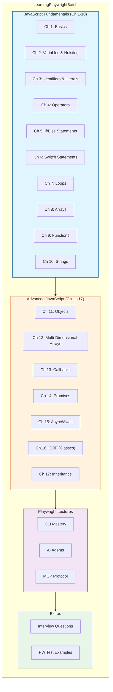

---

## Folder Structure

```
LearningPlaywrightBatch/
├── chapter_01_Basics/                  # Getting started with JavaScript
├── chapter_02_Java_Concepts/           # Variables, hoisting, var/let/const
├── chapter_03_Identifier_Literal_.../  # Identifiers, literals, operators
├── chapter_04_Operators/               # All JavaScript operators
├── chapter_05_Statements/              # If/else conditional statements
├── chapter_06_Switch_Statements/       # Switch case patterns
├── chapter_07_Loops/                   # For, while, do-while loops
├── chapter_08_Arrays/                  # Array methods and manipulation
├── chapter_09_Functions/               # Functions, closures, callbacks
├── chapter_10_Strings/                 # String manipulation methods
├── chapter_11_Objects/                 # Object-oriented programming basics
├── chapter_12_Multi_Dimension_Array/   # 2D arrays and patterns
├── chapter_13_Callback/                # Callback patterns & callback hell
├── chapter_14_Promise/                 # Promise API deep dive
├── chapter_15_Async_Await/             # Modern async programming
├── chapter_16_OOps/                    # Classes, encapsulation, ES6 modules
├── chapter_17_OOPs_Inheritance/        # Inheritance patterns
├── Lecture_Playwright_CLI/             # Playwright CLI commands & tools
├── Lecture_Playwright_AI_Agents/       # AI-powered test automation
├── Lecture_Playwright_MCP/             # Model Context Protocol integration
├── Task_Interview_Coding_Questions/    # Coding challenges
├── PW_JS_Test_1/                       # Playwright test examples
└── specs/                              # Additional test specifications
```

---

## Quick Start

### Prerequisites

- **Node.js** 18+ (recommended)
- **npm** or **yarn**
- **VS Code** (recommended editor)

### Installation

```bash
# Clone the repository
git clone https://github.com/PramodDutta/LearningPlaywrightBatch.git

# Navigate to the project
cd LearningPlaywrightBatch

# Install dependencies
npm install

# Install Playwright browsers
npx playwright install
```

### Run Examples

```bash
# Run a JavaScript file
node chapter_01_Basics/01_basic.js

# Run Playwright tests
npx playwright test

# Open Playwright UI mode
npx playwright test --ui
```

---

## JavaScript Chapters (1-17)

### Learning Flow

```mermaid
flowchart LR
    subgraph Foundation["Foundation"]
        A[Ch 1: Basics] --> B[Ch 2: Variables]
        B --> C[Ch 3: Identifiers]
        C --> D[Ch 4: Operators]
    end

    subgraph Control["Control Flow"]
        D --> E[Ch 5: If/Else]
        E --> F[Ch 6: Switch]
        F --> G[Ch 7: Loops]
    end

    subgraph DataStructures["Data Structures"]
        G --> H[Ch 8: Arrays]
        H --> I[Ch 9: Functions]
        I --> J[Ch 10: Strings]
        J --> K[Ch 11: Objects]
        K --> L[Ch 12: 2D Arrays]
    end

    subgraph Async["Async Programming"]
        L --> M[Ch 13: Callbacks]
        M --> N[Ch 14: Promises]
        N --> O[Ch 15: Async/Await]
    end

    subgraph OOP["Object-Oriented"]
        O --> P[Ch 16: Classes]
        P --> Q[Ch 17: Inheritance]
    end

    style Foundation fill:#e3f2fd
    style Control fill:#fff8e1
    style DataStructures fill:#f3e5f5
    style Async fill:#e8f5e9
    style OOP fill:#fce4ec
```

---

### Chapter 1: Basics
**Files:** `01_basic.js` to `04_hot_code.js`

| Topic | Description |
|-------|-------------|
| Environment Setup | Verifying Node.js installation |
| Hot Code Reloading | Live development workflow |
| First JavaScript | Hello World and basic syntax |

```javascript
// Example: 01_basic.js
console.log("Hello, Playwright Learner!");
```

---

### Chapter 2: Variables & Hoisting
**Files:** `05_Core_Comments_JS.js` to `18_const.js` (14 files)

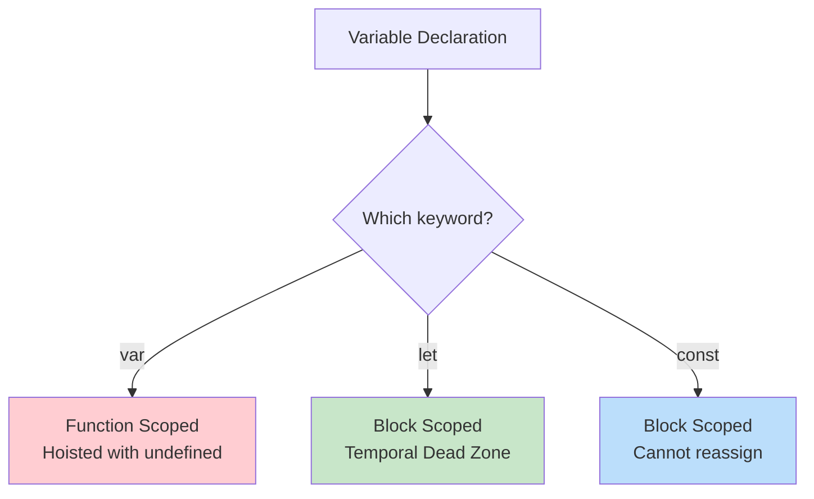

**Key Concepts:**
- `var` vs `let` vs `const` differences
- Hoisting behavior for each keyword
- Temporal Dead Zone (TDZ)
- Block vs function scope

---

### Chapter 3: Identifiers, Literals & Operators
**Files:** `19_Identifier.js` to `25_IQ.js` (7 files)

| Concept | Example |
|---------|---------|
| Identifiers | `userName`, `_private`, `$jquery` |
| String Literals | `"Hello"`, `'World'`, `` `Template` `` |
| Number Literals | `42`, `3.14`, `0xFF` |
| Boolean Literals | `true`, `false` |
| Null vs Undefined | `null` (intentional), `undefined` (uninitialized) |
| Equality | `==` (loose) vs `===` (strict) |

---

### Chapter 4: Operators
**Files:** `26_Assigned_Operator.js` to `32_Null_Optinal_Value.js` (8 files)

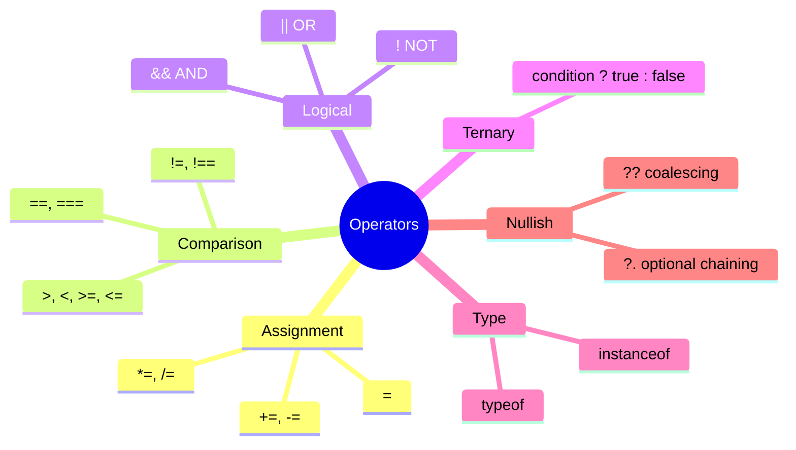

---

### Chapter 5: If/Else Statements
**Files:** `33_Statement.js` to `41_IQ.js` (9 files)

**Key Topics:**
- Simple if/else branching
- If-else-if chains
- Nested conditions
- Real-world API response handling
- Interview questions patterns

```javascript
// Example: API status code validation
const statusCode = 200;
if (statusCode >= 200 && statusCode < 300) {
    console.log("Success!");
} else if (statusCode >= 400) {
    console.log("Error!");
}
```

---

### Chapter 6: Switch Statements
**Files:** `42_Switch.js` to `52_User_Input.js` (11 files)

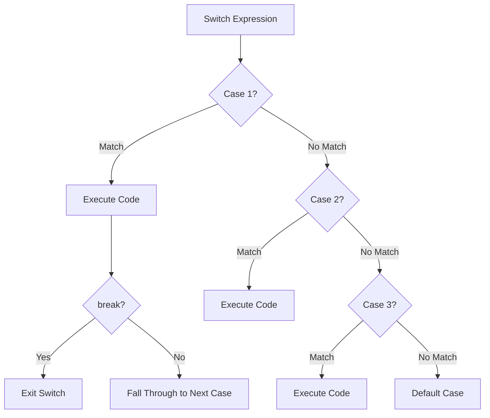

**Key Topics:**
- Switch syntax and break statements
- Default case handling
- Grouped cases (multiple cases, one action)
- When switch beats if-else

---

### Chapter 7: Loops
**Files:** `53_Loops.js` to `62_DO_while_2.js` (10 files)

| Loop Type | Use Case | Syntax |
|-----------|----------|--------|
| `for` | Known iterations | `for (let i=0; i<n; i++)` |
| `while` | Condition-based | `while (condition)` |
| `do-while` | Run at least once | `do { } while (condition)` |

```javascript
// For loop example
for (let i = 1; i <= 5; i++) {
    console.log(`Test case ${i}`);
}
```

---

### Chapter 8: Arrays
**Files:** `63_Arrays_Creation.js` to `75_Task.js` (13 files)

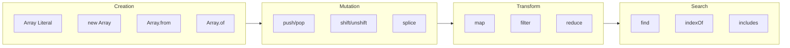

**Key Concepts:**
- Array creation methods
- Adding/removing elements (`push`, `pop`, `shift`, `unshift`, `splice`)
- Searching (`find`, `indexOf`, `includes`)
- Iterating (`forEach`, `map`, `filter`, `reduce`)
- Sorting and slicing
- Shallow vs deep copying
- Array destructuring

---

### Chapter 9: Functions
**Files:** `76_Functions.js` to `101_Callback_me.js` (26 files)

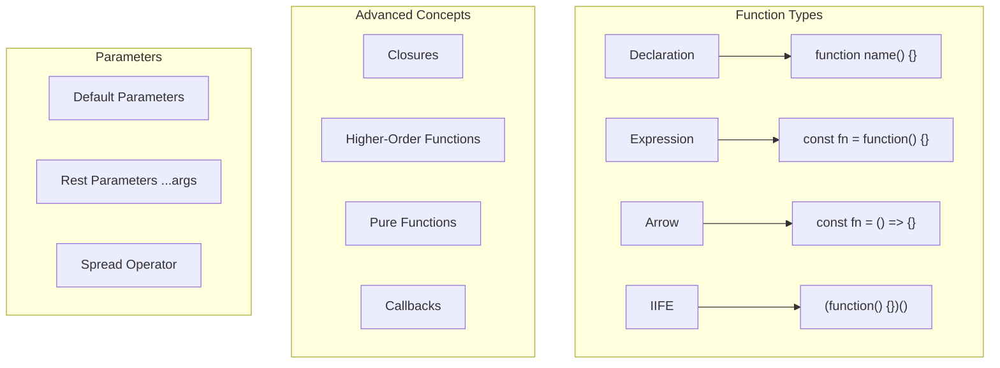

**Key Topics:**
- 4 function types (declaration, expression, arrow, IIFE)
- Parameters: default, rest (`...args`), spread
- Scope and hoisting
- Closures (4-part deep dive)
- Higher-order functions
- Pure functions
- Callback patterns

---

### Chapter 10: Strings
**Files:** `102_Strings.js` to `107_String_Conversion.js` (6 files)

| Category | Methods |
|----------|---------|
| Creation | Single quotes, double quotes, template literals |
| Properties | `length`, index access `str[0]` |
| Search | `includes()`, `indexOf()`, `startsWith()`, `endsWith()` |
| Transform | `toUpperCase()`, `toLowerCase()`, `trim()`, `replace()` |
| Split/Join | `split()`, `join()`, `slice()`, `substring()` |

---

### Chapter 11: Objects
**Files:** `108_Objects.js` to `119_Let_const_Objects.js` (12 files)

```javascript
// Object creation and manipulation
const user = {
    name: "Pramod",
    role: "SDET",
    getInfo() {
        return `${this.name} - ${this.role}`;
    }
};

// Spread operator
const extendedUser = { ...user, company: "TTA" };
```

**Key Topics:**
- Object creation and property access
- Primitive vs reference types
- Property descriptors
- Spread operator with objects
- Getters and setters
- Object methods

---

### Chapter 12: Multi-Dimensional Arrays
**Files:** `120_MD_Array.js` to `125_Pyramid_Pattern.js` (6 files)

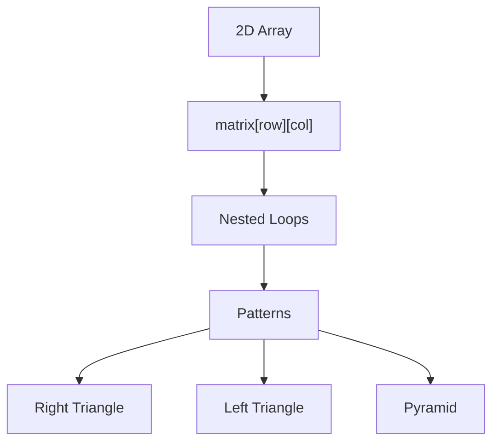

**Key Topics:**
- 2D array creation and access
- Matrix manipulation
- Pattern printing (right, left, pyramid)
- Nested loop techniques

---

### Chapter 13: Callbacks
**Files:** `126_Callback.js` to `132_Py_of_DON.js` (7 files)

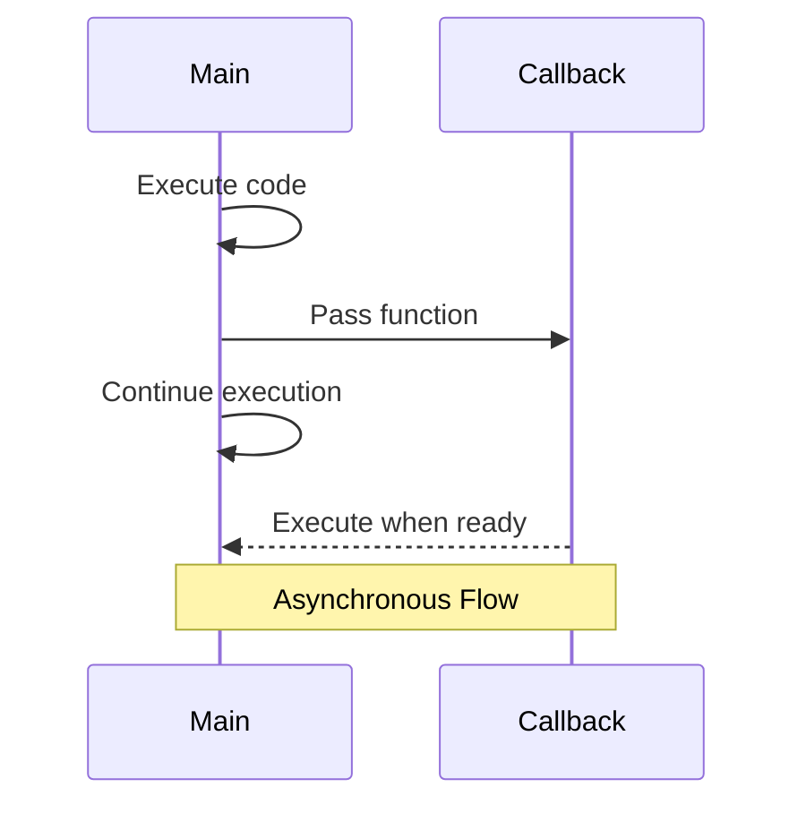

**Key Topics:**
- Synchronous vs asynchronous callbacks
- Callback patterns
- **Callback Hell** (Pyramid of Doom)
- Real-world examples

---

### Chapter 14: Promises
**Files:** `133_Promise.js` to `141_Promise_IQ.js` (9 files)

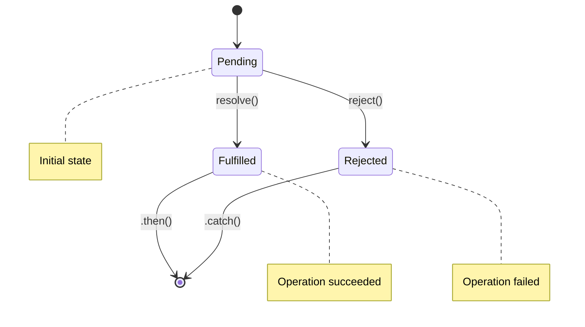

**Key Topics:**
- Promise states (pending, fulfilled, rejected)
- `.then()`, `.catch()`, `.finally()`
- `Promise.all()` - Wait for all
- `Promise.allSettled()` - Get all results
- `Promise.race()` - First to complete
- Interview questions

---

### Chapter 15: Async/Await
**Files:** `142_Async_Await.js` to `149_API_REAL_FLAKY.js` (8 files)

```javascript
// Modern async pattern
async function fetchUserData() {
    try {
        const response = await fetch('/api/user');
        const data = await response.json();
        return data;
    } catch (error) {
        console.error('Failed:', error);
    }
}
```

**Key Topics:**
- Converting Promises to async/await
- Try/catch error handling
- Sequential vs parallel execution
- Real-world API examples
- Handling flaky tests

---

### Chapter 16: OOP - Classes & Encapsulation
**Files:** `150_Export_import.js` to `163_Bank.js` (14 files)

```
chapter_16_OOps/
├── EXPORT_IMPORT/           # ES6 module system
│   ├── 150_Export_import.js
│   ├── 151_Export_Import.js
│   └── 152_Loggger.js
├── CLASS_OBJECT/            # Class fundamentals
│   ├── 153_Class_Objects.js
│   ├── 154_Car.js
│   ├── 155_Class_Object_Browser.js
│   ├── 156_Browser.js
│   ├── 157_IQ.js
│   ├── 158_Private_Public.js
│   ├── 159_Static.js
│   ├── 160_Static_p2.js
│   └── Encapsulation/
│       ├── 161_Pramod_Child.js
│       ├── 162_Car.js
│       └── 163_Bank.js
├── logger.js
├── testutil.js
└── utils.js
```

**Key Topics:**
- ES6 import/export modules
- Class syntax and constructors
- Public vs private fields (`#private`)
- Static methods and properties
- Encapsulation patterns
- Real-world examples (Browser, Car, Bank)

---

### Chapter 17: OOP - Inheritance
**Files:** `164_Inheritance.js` to `174_HI.js` (11 files)

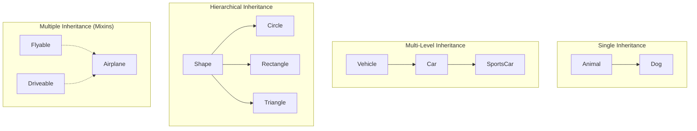

```
chapter_17_OOPs_Inheritance/
├── Single_Inheritance/       # Parent -> Child
│   ├── 164_Inheritance.js
│   ├── 165_SI.js
│   ├── 166_Method_Overriding.js
│   ├── 167_MO_IQ.js
│   ├── 168_MO_BIG.js
│   ├── 169_PageObject.js
│   └── 170_RO.js
├── Multi_Level_Inheritance/  # Grandparent -> Parent -> Child
│   └── 171_MI.js
├── Multiple_Inheritance/     # Using mixins
│   └── 172.js
├── Hierarchial_Inheritance/  # One parent, many children
│   └── 174_HI.js
└── Exporting_Class/          # Module patterns
    ├── Basepage.js
    ├── LoginPage.js
    └── 173_Test_2.js
```

**Key Topics:**
- Single inheritance (`extends`)
- Method overriding (`super`)
- Multi-level inheritance chains
- Hierarchical inheritance
- Multiple inheritance via mixins
- Page Object Model pattern

---

## Playwright Lectures

### Lecture Overview

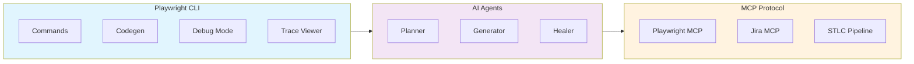

---

### Lecture: Playwright CLI

**Master every command-line tool Playwright offers.**

| Command | Purpose |
|---------|---------|
| `npx playwright test` | Run tests |
| `npx playwright codegen` | Record tests |
| `npx playwright test --ui` | Interactive UI mode |
| `npx playwright test --debug` | Debug with inspector |
| `npx playwright show-report` | View HTML report |
| `npx playwright show-trace` | Analyze trace files |

**Folder Structure:**
```
Lecture_Playwright_CLI/
├── learning/              # 10 learning modules
├── cli_project/           # Demo scripts and tests
├── Project_1_VWO_Login/   # VWO login automation
├── Project_2_TTA_BANK/    # Banking app tests
├── exercises/             # Hands-on practice
├── notes/                 # Quick reference
└── interview_questions/   # 60+ interview Q&A
```

---

### Lecture: Playwright AI Agents

**The future of test automation - AI that plans, generates, and heals tests.**

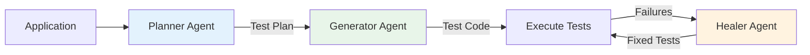

**3 Built-in Agents:**

| Agent | Role | What It Does |
|-------|------|-------------|
| **Planner** | Explores | Crawls app, identifies test scenarios |
| **Generator** | Writes | Converts plans to Playwright code |
| **Healer** | Fixes | Diagnoses and repairs broken tests |

**7 AI Projects Included:**

1. **Natural Language Test Writer** - English to Playwright specs
2. **Self-Healing Locators** - Auto-fixes broken selectors
3. **AI Visual Regression** - Screenshot comparison
4. **Smart Test Reporter** - AI-generated summaries
5. **Accessibility Audit Agent** - WCAG compliance
6. **Autonomous Explorer** - Bug hunting without scripts
7. **AI API Testing** - Contract validation

**Folder Structure:**
```
Lecture_Playwright_AI_Agents/
├── learning/              # 13 learning modules
├── agents_project/        # Agent pipeline demos
├── ai_projects/           # 7 practical AI projects
├── exercises/             # Hands-on practice
├── notes/                 # Quick reference
└── interview_questions/   # 60+ interview Q&A
```

---

### Lecture: Playwright MCP (Model Context Protocol)

**Automate the entire Software Testing Life Cycle with AI.**

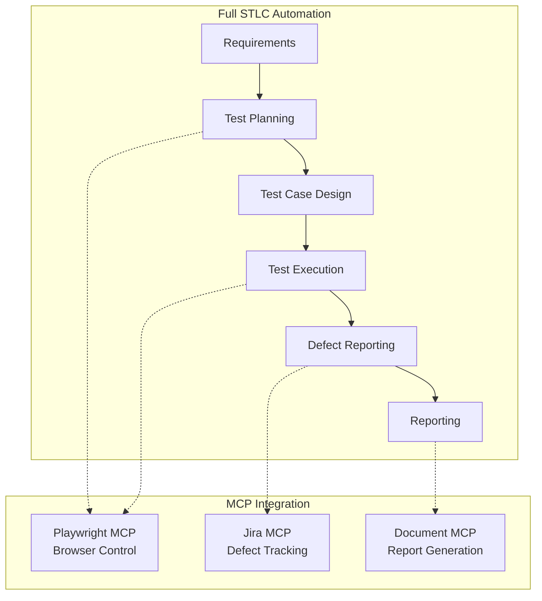

**Key Components:**
- **Playwright MCP** - Browser automation via AI
- **Jira MCP** - Automated defect reporting
- **Document MCP** - Test plan and report generation

**Folder Structure:**
```
Lecture_Playwright_MCP/
├── learning/           # 8 learning modules
├── stlc_project/       # Full STLC pipeline
│   ├── mcp_scripts/    # MCP automation scripts
│   └── jira_mock/      # Mock Jira server
├── exercises/          # Hands-on practice
├── notes/              # Quick reference
└── interview_questions/ # Interview Q&A
```

---

## Learning Path

### Recommended Progression


### Quick Reference

| Phase | Chapters | Focus |
|-------|----------|-------|
| **Beginner** | 1-7 | Syntax, control flow, loops |
| **Intermediate** | 8-12 | Data structures, functions |
| **Advanced** | 13-17 | Async, OOP patterns |
| **Playwright** | CLI, AI, MCP | Test automation |

---

## Interview Preparation

### Coding Challenges

Located in `Task_Interview_Coding_Questions/`:

| File | Challenge |
|------|-----------|
| `01_grade_calc.js` | Grade calculator from scores |
| `02_fizz_buzz.js` | Classic FizzBuzz problem |

### Interview Questions

Each lecture folder contains `interview_questions/` with **60+ Q&A** covering:
- JavaScript fundamentals
- Playwright concepts
- AI/ML in testing
- MCP architecture

---

## Running Tests

```bash
# Run all Playwright tests
npx playwright test

# Run with UI mode (interactive)
npx playwright test --ui

# Run specific test file
npx playwright test specs/sample.spec.js

# Run with debug mode
npx playwright test --debug

# Generate HTML report
npx playwright test --reporter=html

# View last report
npx playwright show-report
```

---

## Project Information

| | |
|---|---|
| **Author** | Pramod Dutta |
| **Organization** | The Testing Academy |
| **License** | ISC |
| **Playwright Version** | 1.58.2+ |
| **Node.js** | 18+ recommended |

---

## Resources

- [Playwright Documentation](https://playwright.dev/docs/intro)
- [The Testing Academy](https://thetestingacademy.com)
- [GitHub Repository](https://github.com/PramodDutta/LearningPlaywrightBatch)

---

<div align="center">

**Happy Learning!**

*Built with dedication for the SDET community*


</div>
